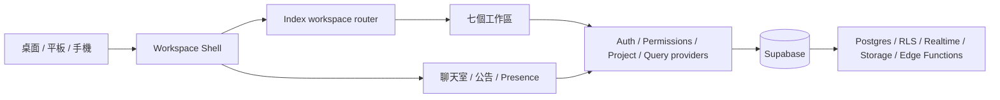

# 工作整合平台

**Station Status Hub** 是提供測試站、硬體工程與管理團隊共同使用的整合工作平台。它把機台維修、BOM 與料號、Data Center、PCB 設計、權限管理、AI 資料查詢和績效考核收進同一套登入、權限、即時同步與響應式介面。

[開啟線上版本](https://lovableteat.github.io/station-status-hub/) · [閱讀完整架構](./docs/architecture.md) · [查看最新交接](./docs/codex-handoff-2026-08-10.md)

## 平台介紹影片

[](https://lovableteat.github.io/station-status-hub/videos/platform-introduction.mp4)

[▶️ **直接播放工作整合平台介紹影片**](https://lovableteat.github.io/station-status-hub/videos/platform-introduction.mp4)

影片檔已部署至 GitHub Pages；GitHub README 會過濾播放器標籤，點擊播放連結即可在瀏覽器內直接觀看。影片來源：[YouTube](https://www.youtube.com/watch?v=uegeSwdfWjQ)。

## 平台內容

平台目前有七個正式工作區，入口會依使用者權限顯示：

| 工作區 | 主要用途 | Workspace ID |
| --- | --- | --- |
| 機台維修紀錄中心 | 儀表板、測試流程、產線監控、問題追蹤與工具管理 | `station-status` |
| 料號申請 | BOM、主料與替代料、供應商明細、申請、匯入匯出與多人同步 | `material-requests` |
| Data Center | 機櫃與設備配置、2D 規劃、3D 數位孿生與場景管理 | `data-center` |
| PCB Designer | PCB 專案、2D 編輯、3D 檢視、STEP 模型、元件庫、禁制區與切板 | `pcb-designer` |
| 後台管理 | 帳號、角色、工作區權限、公告、在線狀態與 API 金鑰 | `user-management` |
| 資料查詢空間 | AI 對話、附件、圖片與文件分析、知識搜尋和引用來源 | `ai-chat` |
| 績效考核系統 | 考核週期、目標進度、主管回饋、評分、團隊檢視與報表 | `performance` |

全站聊天室、私訊、在線狀態、公告中心、手機開啟 QR Code 與帳號資料是跨工作區共用能力，不是額外的第八個頁面。

## 系統架構



`src/pages/Index.tsx` 是全站工作區分派中心。頁面使用 `workspace` 與 `module` query parameter 保存可分享的目前位置，例如：

```text
?workspace=pcb-designer&module=pcb-designer
```

大型工作區以 lazy import 載入，避免首頁同時下載 3D、試算表與 AI 相關依賴。`src/lib/workspacePermissions.ts` 集中管理七個入口及細部頁面權限；資料安全則由 Supabase RLS、RPC 與 Storage policy 最終把關。

## 專案地圖

```text
station-status-hub/
├─ src/
│  ├─ App.tsx                         # Runtime、Provider、登入閘門與 routes
│  ├─ pages/Index.tsx                 # Workspace shell、URL 狀態與頁面分派
│  ├─ components/layout/              # 頂部導覽、首頁入口與手機工作列
│  ├─ components/maintenance/         # 機台維修工作區
│  ├─ components/material-requests/   # 料號與 BOM 工作區
│  ├─ components/data-center/         # Data Center 2D / 3D
│  ├─ components/pcb-designer/        # PCB 畫面、同步與可測試 core
│  ├─ components/admin/               # 後台帳號、公告與權限
│  ├─ components/api-management/      # API 控制台與 AI 資料查詢
│  ├─ components/performance/         # 績效考核工作區
│  ├─ components/collaboration/       # 全站聊天室與私訊
│  ├─ hooks/                          # 資料、權限、Presence 與即時同步 hooks
│  └─ lib/workspacePermissions.ts     # Workspace 與細部頁面權限規則
├─ supabase/
│  ├─ migrations/                     # Schema、RLS、RPC 與 Realtime 變更
│  └─ functions/                      # Edge Functions 與 API proxy
├─ tests/                              # 工作區、RWD、權限與回歸測試
├─ scripts/                            # STEP / GLB 等模型轉換工具
├─ public/models/                      # 經審核後納入部署的 3D 資產
└─ docs/architecture.md                # 完整架構、資料流與開發規則
```

第一次接手請先閱讀 [`docs/architecture.md`](./docs/architecture.md) 的「目錄地圖」、「Workspace 與 module」、「Provider 與資料流」及「新功能開發流程」，再進入對應功能。不要從單一畫面元件推測資料來源或複製另一套權限邏輯。

## 本機啟動

需求：Node.js 20 以上與 npm。

```bash
npm install --legacy-peer-deps
npm run dev
```

Vite 預設入口：

```text
http://localhost:8080/station-status-hub/
```

本機需要 Supabase 時，請複製 [`.env.example`](./.env.example) 為 `.env`，再填入瀏覽器可公開的專案 URL 與 anon key。`.env` 只存在本機，不得加入 Git：

```dotenv
VITE_SUPABASE_URL=your-project-url
VITE_SUPABASE_ANON_KEY=your-anon-key
VITE_REALTIME_COLLABORATION_V2=true
```

不得將 `.env`、service role key、API provider secret、使用者密碼或未遮罩金鑰提交到 Git；`.env.example` 只保留變數名稱，不放任何值。

## 開發與驗證

```bash
npm run lint
npx tsc --noEmit
npm run build
npm run test:pcb
```

`tests/` 另外包含 RWD、權限、後台、料號、Data Center、AI、聊天室與績效考核的 Node 回歸測試。修改工作區後不能只看程式碼，至少要實際驗證：

1. 桌面、平板、手機直向與手機橫向沒有水平跑版或操作被遮住。
2. Loading、empty、error、success 與 disabled 狀態都有明確回饋。
3. 上傳、下載、預覽、刪除、儲存、搜尋、返回與重新載入可完成。
4. 需要同步的資料換帳號或換裝置後仍可見，權限不足時不能繞過 UI 存取。
5. PCB 的 2D / 3D 座標、旋轉、Top / Bottom、切板與專案重載保持一致。

## 資料與權限

- 前端由 `UserProvider`、`PermissionsProvider`、`TestProjectProvider`、`UnifiedDataProvider` 與 `UserPresenceProvider` 統一管理登入、權限、專案和協作狀態。
- Supabase 是正式資料來源，涵蓋 Auth、Postgres、RLS、Realtime、Storage 與 Edge Functions；localStorage 只用於必要的快速顯示或離線兜底。
- Migration 放在 [`supabase/migrations`](./supabase/migrations)，正式環境不可 reset、刪除 schema 或任意重播歷史 migration。
- 應用資料表統一歸檔在 `workspace` schema；Supabase 管理的 `auth`、`storage`、`realtime` schema 不修改。Hosted Supabase 的 API Exposed schemas 必須加入 `workspace`，再套用對應 migration。
- 權限新增或調整時，必須同步檢查入口顯示、workspace access、細部 module 權限、RLS/RPC 與手機導覽。
- API 金鑰只顯示遮罩值；建立、測試、停用與刪除流程不得把明文寫入前端 log 或文件。

## 部署方式

`main` 分支推送後，[GitHub Actions](./.github/workflows/main.yml) 會使用 Node.js 20 安裝依賴、建立 production bundle，並部署到 GitHub Pages。`VITE_SUPABASE_URL` 與 `VITE_SUPABASE_ANON_KEY` 由 GitHub Secrets 提供，`VITE_REALTIME_COLLABORATION_V2` 由 GitHub Variables 提供，不存放在儲存庫。

提交前請確認 `git status`，只加入本次正式程式、測試、migration 與文件。`.preview-current/`、`tmp/`、`supabase/.temp/`、本機轉檔產物和未經審核的大型模型不可一併提交。

## 深入文件

- [`docs/architecture.md`](./docs/architecture.md)：完整架構、工作區資料流、RWD、PCB、Supabase、測試與排錯指南。
- [`docs/codex-handoff-2026-08-10.md`](./docs/codex-handoff-2026-08-10.md)：近期交付內容、驗證結果與儲存庫狀態。
